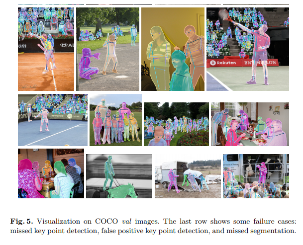
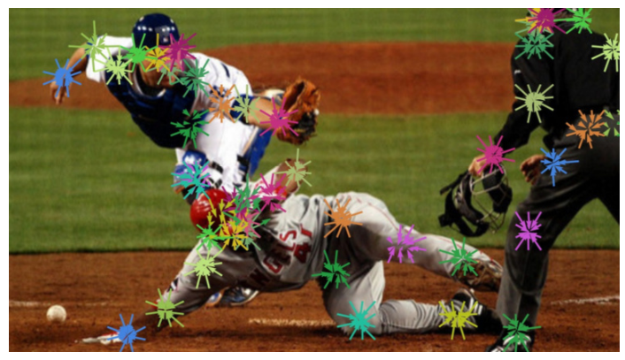
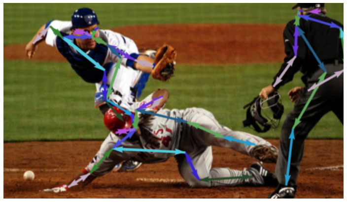
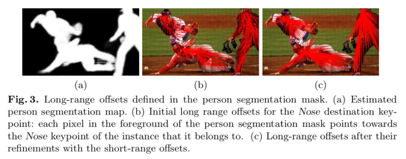
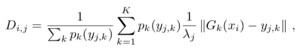
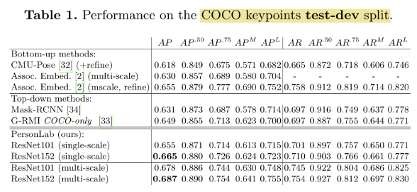

# PersonLab: Person Pose Estimation and Instance Segmentation with a Bottom-Up, Part-Based, Geometric Embedding Model (2018)

## 원리

- Bottom-up 방식의 Pose Estimation에서
  - Short/MidAssociation Vector를 추가해 기존의 방식보다 간단하고 빠르고 정확하게 human instance별로 Key Point를 찾아냄
  - Long Association Vector를 이용해서 Human에 대한 Instance Segmentation 도 같은 방식으로 처리함

1) **Offset Field 를 출력하도록 학습**

  - Short-range offset

    - 관절의 위치를 정확하게 찾아내기 위해, 히트맵을 뽑고,
    - 그 중심점을 향하는 벡터값을 학습시킴

- Mid-range offset

- 각 joint point 를 사람 별로 구별하는데 사용
- 위에 계산된 Short-range offset과 더해서 최종 벡터를 뽑음.
- 추출된 히트맵에서 점수가 높았던 키포인트부터, Mid-range offset vector를 따라가면서 Human Instance 들을 연결한다.

2) **Output은 총 2가지다.**

  - Long-range offset

    - 픽셀로부터 각 관절간의 연결을 추정함

-  Semantic Segmentation Heatmap

    - Long-range offset 을 이용해서 각 픽셀과 각 Instance 사이에 Distance를 정의하고
    - 이를 이용해서 Semantic Segmentation Map을 Instance 별로 구분

    - 픽셀 i와 인스턴스j 사이의 거리는, 해당 픽셀에서 Long-range offset field에서 얻은 각 관절의 위치와 실제 관절의 위치의 거리가 가까울 수록 거리가 가까워진다
    - 여기에 크기나, Key point의 점수와 인스턴스 크기를 이용해 Scale을 조절

## 결과

- CMU-Pose (OpenPose) 보다 훨씬 높은 성능을 보임