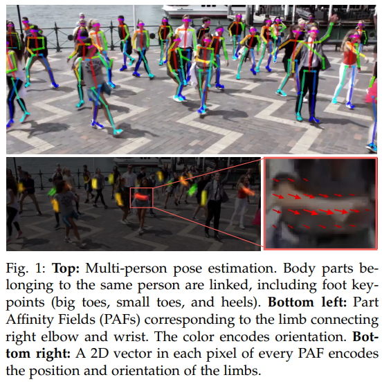
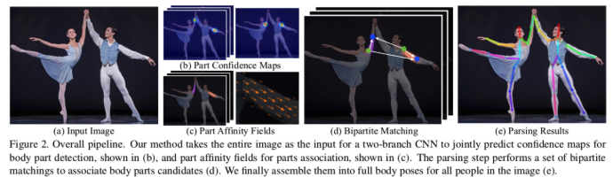
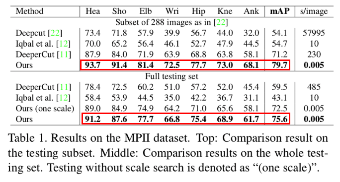
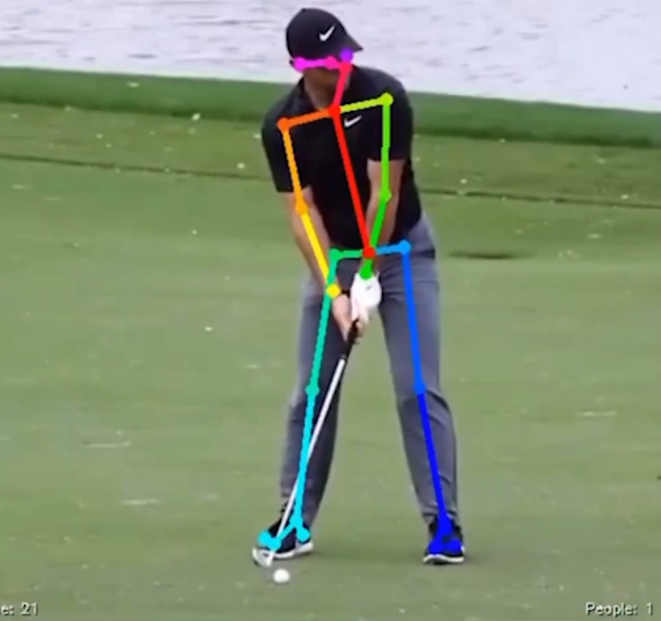
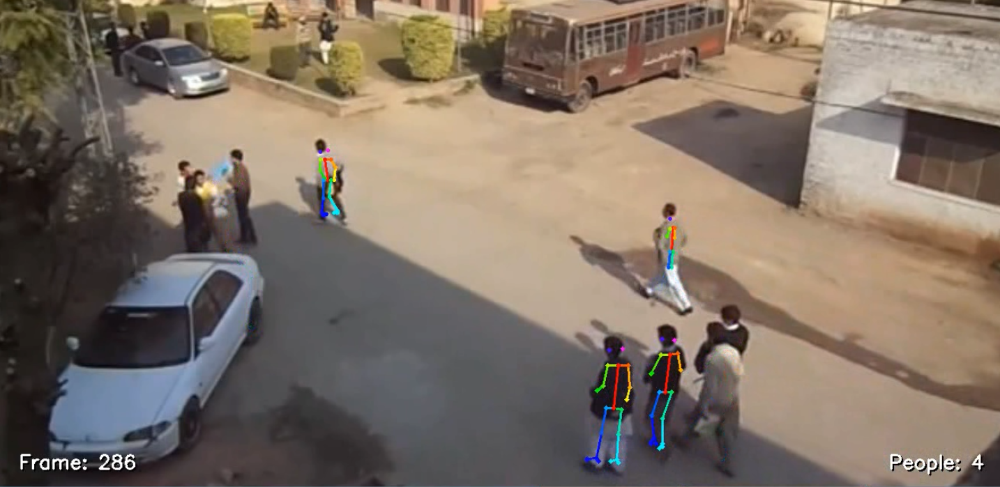

# OpenPose: Realtime Multi-Person 2D Pose Estimation using Part Affinity Fields (2017)

## 원리

- Bottom-up 방식의 Pose Estimation에서
  - 각 관절들의 위치를 Heatmap 형태로 잘 찾아내면서 동시에 각 관절들의 관계를 *'Part Affinity Map'* 이라는 또 다른 Output으로 부터 얻어, 취합하는 방식으로 접근

네트웍의 Output은 총 2가지이다.

1) **Part Confidence Maps**
- 일종의 Heatmap. 각 관절이 있을 것 같은 위치를 표현. (기존에 쓰이던 방식과 동일)
2) **Part Affinity Fields**
- 일종의 관계를 표현하는 Vectormap. 특정 관절로부터 다른 관절로 이어지는 것을 표현한 맵
    - ex) 오른쪽 어깨와 오른쪽 팔꿈치는 연결이 강하므로 그 둘 사이에 Part Affinity Fields 에는 1에 가까운 큰 값으로 채워짐.

> 3줄 요약

- Part Confidence Maps 와 Part Affinity Fields 를 출력하고 나면
- 이 정보와 애초에 입력되었던 이미지의 Feature를 모아서 다음 네트워크에 넘기고
- 다음 네트워크가 결과를 또 그 다음 네트워크에, 그렇게 마지막 네트워크에 도달할 때 까지 반복

## 결과 및 성능

> 모든 joint 에서 좋은 성능

- 여러 사람에 대해 각각 처리하지 않아도, 한 이미지에 대해 Network Forwarding 결과를 적절히 취합하는 방식이므로,
- 9명의 예제에 대해 **100ms 수준의 CNN 연산 시간과 0.58ms 수준**의 후 처리가 필요했다고함

## YW Memo

실제 데이터로 돌려보면

- 320 * 240 / 30fps
    - 화질이 매우 낮음
    - 돌릴땐 640 * 480 으로 Upscaling 후 진행
- 정/측면 2 side로 촬영된 영상

### 그래서..

측면 영상에서는 Skeleton 이 끊어지지 않고 잘 이어지지만, 정면 영상에서는 (특히 ~~**다운스윙때**~~) Skeleton이 상당히 끊어짐.

여러 사람을 인식할 때도 해상도를 많이 타는듯 함